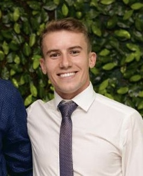

 
*This is the professional website of agronomist Maykon Junior da Silva. I grew up on a family farm in the South of Brazil. I did my undergraduate studies at Federal University of Santa Maria, majoring in Agronomic Engineering. Currently, I am a second year Master's Student in the Applied Plant Sciences Program in the Department of Agronomy and Plant Genetics at the University of Minnesota. I am a member of the Naeve lab, working with management strategies for iron deficiency chlorosis in soybeans. I am also the former treasurer of the APS Grad Club and part of the organizing committee for the Plant Sciences Symposium.*  
  
  
  
  

*After graduation, I hope to work for an institution or industry in which I can help develop or improve technologies that will enhance crop performance and make food production more sustainable, be of use to solve real-world problems, and consequently benefit farmers and consumers. In my spare time, I greatly enjoy playing soccer, grilling, camping, and hanging out with my friends.*  

*This website was developed with the use of R, RMarkdown, and GitHub. Interactive graphs, Spatial Mapping and Shiny App were done using sf, gt, ggplot, ggmaps, tidycensus, ggplotly, plotly, leaflet, and shiny*  

>“The future depends on what you do today.” – Mahatma Gandhi
